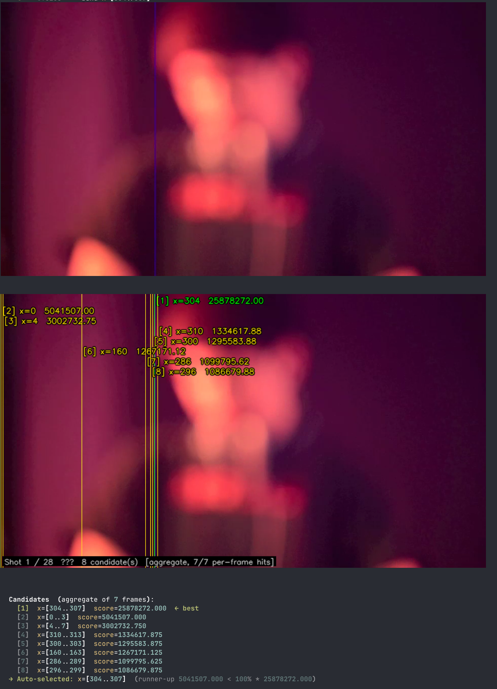
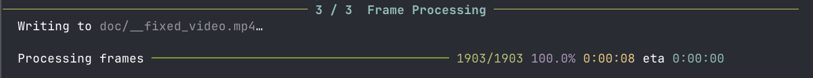
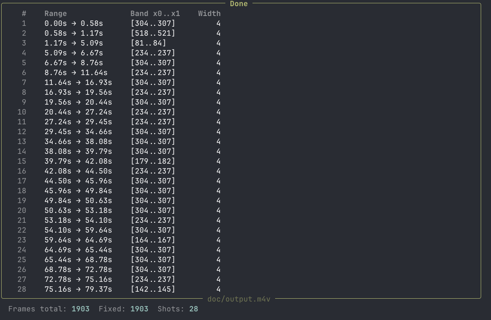

# fix-video-band

Detect and repair stuck-pixel vertical bands in video files.

Some cameras produce a narrow column of corrupted pixels — a "stuck band" — that
appears at a fixed horizontal position throughout a clip.  `fix-video-band` automatically
locates the band per scene cut and rebuilds those columns using OpenCV's content-aware
inpainting (Telea Fast Marching Method), then re-muxes the original audio.

## Requirements

- Python 3.13+
- [ffmpeg](https://ffmpeg.org/) on `PATH` (used for scene detection and audio mux)

## Installation

### uvx (run directly from GitHub, no install needed)

```sh
uvx --from git+https://github.com/akshetpandey/fix_video_band fix-video-band input.mp4 output.mp4
```

### uv tool (persistent install from GitHub)

```sh
uv tool install git+https://github.com/akshetpandey/fix_video_band
fix-video-band input.mp4 output.mp4
```

### pip (install from GitHub)

```sh
pip install git+https://github.com/akshetpandey/fix_video_band
fix-video-band input.mp4 output.mp4
```

### From a local clone

```sh
git clone https://github.com/akshetpandey/fix_video_band.git
cd fix_video_band
uv run fix-video-band input.mp4 output.mp4
```

## Usage

```
fix-video-band INPUT OUTPUT [options]
```

### Arguments

| Argument | Description |
|---|---|
| `INPUT` | Source video file (any format ffmpeg can read) |
| `OUTPUT` | Destination video file |

### Options

| Option | Default | Description |
|---|---|---|
| `--tmp-video PATH` | `__fixed_video.mp4` | Intermediate video-only file (deleted after mux) |
| `--scene-thresh FLOAT` | `0.30` | FFmpeg scene-change threshold. Higher → fewer cuts detected |
| `--min-shot-len FLOAT` | `0.50` | Minimum shot length in seconds; shorter segments are merged |
| `--samples INT` | `7` | Frames sampled per shot for band estimation |
| `--detect-win INT` | `31` | Rolling-median window width for baseline (must be odd) |
| `--detect-z FLOAT` | `6.0` | Detection threshold in robust sigmas (MAD-based) |
| `--band-width INT` | `4` | Exact defect band width in pixels |
| `--auto-thresh FLOAT` | `0.7` | Auto-select winner when runner-up scores below this fraction of the winner's score. Set to `0` to always prompt, `1` to never prompt |
| `--pad INT` | `3` | Inpaint radius (pixels sampled outside the band mask) |
| `--codec FOURCC` | `avc1` | FourCC codec for intermediate file (`avc1` = H.264) |
| `--display-cols INT` | `120` | Terminal column width for inline frame previews (iTerm2) |

## How it works

### 1 — Scene detection

`ffmpeg`'s `select='gt(scene,THRESH)'` filter produces cut timestamps.  Short
segments below `--min-shot-len` are merged into adjacent shots so that very
quick transitions don't create independent shots that are too brief to sample.

### 2 — Band estimation

For each shot, `--samples` frames are decoded at evenly spaced timestamps.  Each
frame is reduced to a per-channel column mean profile (shape `W×3`, one value per
pixel column per BGR channel).

Detection uses:

1. **Per-channel robust Z-score** — a rolling median baseline is subtracted and the
   deviation is normalised by the MAD (median absolute deviation).  This suppresses
   gradual illumination changes while making stuck columns stand out.
2. **Channel-wise max** — the three Z-score profiles are collapsed to a single
   combined signal by taking the per-column maximum.  A single-channel defect (e.g.
   a stuck-blue column that looks dark in grayscale) is not diluted.
3. **Matched filter** — a box kernel of exactly `--band-width` columns is convolved
   with the combined signal to score each possible band position.
4. **Greedy NMS** — up to 8 non-overlapping candidate bands are extracted from the
   windowed score profile in score order.
5. **Temporal aggregation** — the per-frame profiles are median-stacked before the
   final candidate search, suppressing scene content and reinforcing the static defect.

After ranking candidates, the tool shows a raw reference frame and an annotated
preview (inline in iTerm2; a vertical line marks each candidate's starting column).

If the runner-up candidate scores below `--auto-thresh × best_score`, the winner is
selected automatically.  Otherwise, an interactive prompt lets you choose.

### 3 — Frame repair

Every frame is processed sequentially.  For each frame the band columns are masked
and rebuilt with `cv2.inpaint(INPAINT_TELEA)`.  The Telea algorithm propagates
gradient information inward from the boundary pixels, correctly handling scene
content — edges, gradients, fine texture — without assumptions about the defect.

After all frames are written, `ffmpeg` muxes the original audio stream into the
output file (no re-encode).

## Example run

Running the tool on a video with a stuck-pixel band at column 304:

```sh
fix-video-band input.m4v output.m4v
```

### Step 1 — Scene detection and band estimation

The tool splits the video into shots, samples frames from each, and detects
candidate bands using robust statistical analysis. In a supported terminal
(iTerm2 or Ghostty) it displays inline frame previews showing the raw reference
frame and an annotated view with all candidates marked:



The green line marks the winning candidate; yellow lines show runners-up.  When
the best candidate clearly dominates, it is auto-selected.  Otherwise an
interactive prompt lets you choose.

### Step 2 — Frame processing

Every frame is decoded sequentially and the detected band columns are repaired
using OpenCV's Telea inpainting algorithm.  A progress bar tracks the work:



### Step 3 — Summary

After all frames are written, the original audio is muxed into the output file.
A summary table lists each shot, its time range, and the band that was repaired:



### More examples

```sh
# Basic — auto-select band, write to fixed.mp4
fix-video-band raw.mp4 fixed.mp4

# Fewer scene cuts, prompt for every shot
fix-video-band raw.mp4 fixed.mp4 --scene-thresh 0.5 --auto-thresh 0

# Wider defect band, lower detection sensitivity
fix-video-band raw.mp4 fixed.mp4 --band-width 6 --detect-z 4.0

# Force manual band entry for every shot
fix-video-band raw.mp4 fixed.mp4 --auto-thresh 1.0
```

## Frame previews

Inline frame previews are displayed when running in a terminal that supports the
iTerm2 or Kitty graphics protocols:

- [iTerm2](https://iterm2.com/)
- [Ghostty](https://ghostty.org/)
- [WezTerm](https://wezfurlong.org/wezterm/)
- [Konsole](https://konsole.kde.org/)

In unsupported terminals, image output is silently skipped and the tool still
works — you just won't see the visual previews.

## License

MIT
